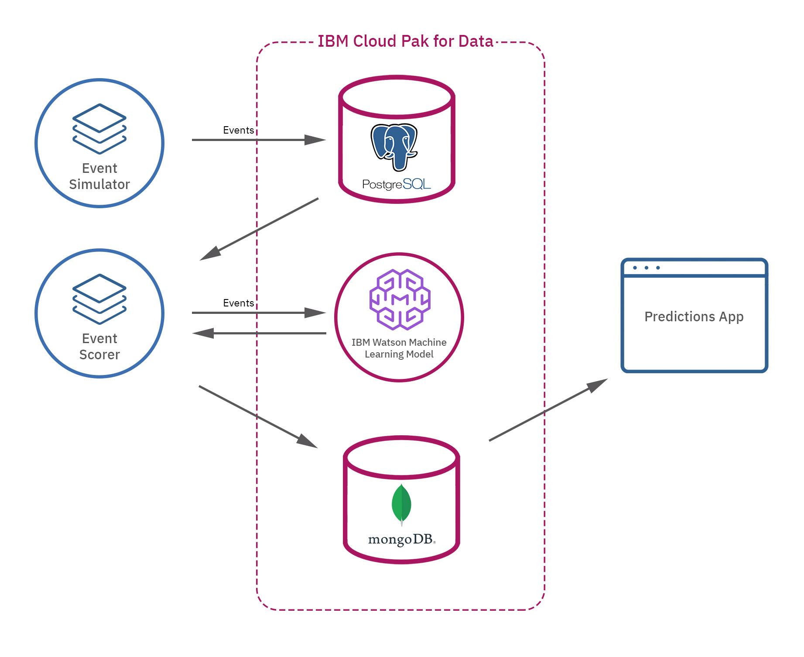

# Watson Machine Learning Quickstart

The Watson Machine Learning Quickstart demonstrates use of PostgreSQL, Watson Machine Learning, and MongoDB on Cloud Pak for Data to continuously enrich enterprise data with machine learning insights. 

In this example, we have one application producing simulated refrigeration container (reefer) telemetry events that include temperature, humidity, cumulative power consumption, etc. The events are persisted in a PostgreSQL database.
The second application polls the telemetry data, applies a machine learning model to determine whether or not a given refrigeration unit requires maintenance, and stores the results in a MongoDB collection.
The most recent results are displayed in a simple web application. 

                     
## Getting started

### Installing the Watson Assistant add-on on IBM Cloud Pak for Data 

Make your data ready for an AI and multicloud world. Cloud Pak for Data System is an all-in-one cloud-native Data and AI platform in a box, providing a pre-configured, governed, and secure environment to collect, organize and analyze data. [Learn more](https://docs-icpdata.mybluemix.net/docs/content/SSQNUZ_current/com.ibm.icpdata.doc/zen/overview/overview.html).

Installing Cloud Pak for Data on OpenShift- [Instructions](https://docs-icpdata.mybluemix.net/docs/content/SSQNUZ_current/com.ibm.icpdata.doc/zen/install/ovu.html)

Installing the Watson Machine Learning add-on - [instructions](https://docs-icpdata.mybluemix.net/docs/content/SSQNUZ_current/com.ibm.icpdata.doc/dsx/wmlservices.html)

Installing the PostgreSQL add-on [instructions](https://docs-icpdata.mybluemix.net/docs/content/SSQNUZ_current/com.ibm.icpdata.doc/zen/admin/create-db.html) see the PostgreSQL section.

Installing the MondoDB add-on [instructions](https://docs-icpdata.mybluemix.net/docs/content/SSQNUZ_current/com.ibm.icpdata.doc/zen/admin/create-db.html) see the MongoDB section.

### Create your own copy of this repo
Fork a copy of [cpd-quick-start-watson-machine-learning](https://github.com/estherhi/cpd-quick-start-watson-machine-learning)

### Creating a project

After logging in with `oc login`, if you don't have a project setup all ready, go ahead and take care of that:
 
         $ oc new-project my-project --display-name="My Project"
 
 That's it, project has been created. It would probably be good to set your current project, such as:
 
         $ oc project my-project

### Creating the app from a template

Create the app from the [cpd-quick-start-watson-machine-learning.json](cpd-quick-start-watson-machine-learning.json) template by using the `-f` flag and pointing the tool at a path to the template file. Learn more about [OpenShift templates](https://docs.openshift.com/enterprise/3.0/dev_guide/templates.html#dev-guide-templates).

First, list the parameters that you can use:

        $ oc process --parameters -f https://raw.githubusercontent.com/estherhi/cpd-quick-start-watson-machine-learning/master/openshift/templates/cpd-quick-start-watson-machine-learning.json

### required parameters

Create the app from the template and specify the source url to be your forked repo:

        $ oc new-app -f \
        https://raw.githubusercontent.com/estherhi/cpd-quick-start-watson-machine-learning/master/openshift/templates/cpd-quick-start-watson-machine-learning.json \
        -p POSTGRESQL_HOST=<POSTGRESQL_HOST> \
        -p POSTGRESQL_USER=<POSTGRESQL_USER> \
        -p POSTGRESQL_PASSWORD=<POSTGRESQL_PASSWORD> \
        -p POSTGRESQL_DATABASE=<POSTGRESQL_DATABASE_NAME>\
        -p MONGODB_HOST=<MONGO_HOST> \
        -p MONGODB_USER=<MONGO_USER> \
        -p MONGODB_PASSWORD=<MONGO_PASSWORD> \
        -p MONGODB_DATABASE=<MONGO_DATABASE_NAME> \
        -p ICP4D_CLUSTER_HOST=<ICP4D_CLUSTER_HOST> \
        -p ICP4D_CLUSTER_USER=<ICP4D_CLUSTER_USER> \
        -p ICP4D_CLUSTER_PASSWORD=<ICP4D_CLUSTER_PASSWORD> 

#### Build the app

`oc new-app` will kick off a build once all required dependencies are confirmed.

Check the status of your new nodejs app with the command:

        $ oc status
        
        
Which should return something like:

       In project My Project (my-project) on server https://192.168.64.3:8443
     
       svc/watson-machine-learning-event-scorer - 172.30.223.123:8080 -> 3000
         dc/watson-machine-learning-event-scorer deploys istag/watson-machine-learning-event-scorer:latest <-
           bc/watson-machine-learning-event-scorer source builds https://github.com/estherhi/cpd-quick-start-watson-machine-learning on openshift/python:3.6 
             build #1 failed 40 seconds ago
           deployment #1 waiting on image or update      
        
        
If the build is not yet started (you can check by running `oc get builds`), start one and stream the logs with:

        $ oc start-build watson-machine-learning-event-scorer --follow
        
#### Deploy the app

Deployment happens automatically once the new application image is available.  To monitor its status either watch the web console or execute `oc get pods` to see when the pod is up.  Another helpful command is

        $ oc get svc
        
This will help indicate what IP address the service is running, the default port for it to deploy at is 8080. Output should look like:

        NAME                                   TYPE        CLUSTER-IP       EXTERNAL-IP   PORT(S)     AGE
        watson-machine-learning-event-scorer   ClusterIP   172.30.223.123   <none>        8080/TCP    13h
        
#### Routing

An OpenShift route exposes a service at a host name, like www.example.com, so that external clients can reach it by name.

DNS resolution for a host name is handled separately from routing; you may wish to configure a cloud domain that will always correctly resolve to the OpenShift router, or if using an unrelated host name you may need to modify its DNS records independently to resolve to the router.

That aside, let's explore our new web app. `oc new-app` created a new route. To view your new route:

        $ oc get route

In the result you can find all routes in your project and for each route you can find its hostname.  
Find the `watson-assistant-quickstart` route and use the hostname to navigate to the newly created Node.js web app.
Notice that you can use the `APPLICATION_DOMAIN` template parameter to define a hostname for your app.

To create a new route at a host name, like www.example.com:

        $ oc expose svc/watson-machine-learning-event-scorer --hostname=www.example.com

#### Success

You should now have two applications: one producing events and storing it in the reefer_container_events table in PostgreSQL database you had configured.  
The other application persists and deploys a pickled model that predicts maintenance in the Watson Machine Learning instance. 
The results are stored in the MongoDB database and displayed in a web application.

### Adding Webhooks and Making Code Changes
Assuming you used the URL of your own forked repository, you can configure your github repository to make a webhook call whenever you push your code. Learn more about [Webhook Triggers](https://docs.openshift.com/container-platform/3.5/dev_guide/builds/triggering_builds.html#webhook-triggers).

1. From the Web Console homepage, navigate to your project
2. Go to Builds
3. Click the link with your BuildConfig name
4. Click the Configuration tab
5. Click the "Copy to clipboard" icon to the right of the "GitHub webhook URL" field
6. Navigate to your repository on GitHub and click on repository settings > webhooks > Add webhook
7. Paste your webhook URL provided by OpenShift
8. Leave the defaults for the remaining fields - That's it!
9. After you save your webhook, if you refresh your settings page you can see the status of the ping that Github sent to OpenShift to verify it can reach the server.

### Known issues
1. Model versions supported in Watson Machine Learning is documented here - https://docs-icpdata.mybluemix.net/docs/content/SSQNUZ_current/com.ibm.icpdata.doc/dsx/models.html
2. The Watson Machine Learning Client api currently does not return the stored and deployed models for a given model, only lists them, hence the developer is responsible for clean up and deletion of the models.
3. We are currently using an insecure connection for Cloud Pak for Data - for production readiness you must use signed certificates.
[Learn more](https://www.ibm.com/support/knowledgecenter/SSQNUZ_current/com.ibm.icpdata.doc/zen/install/https-config.html)

## License
TBD
